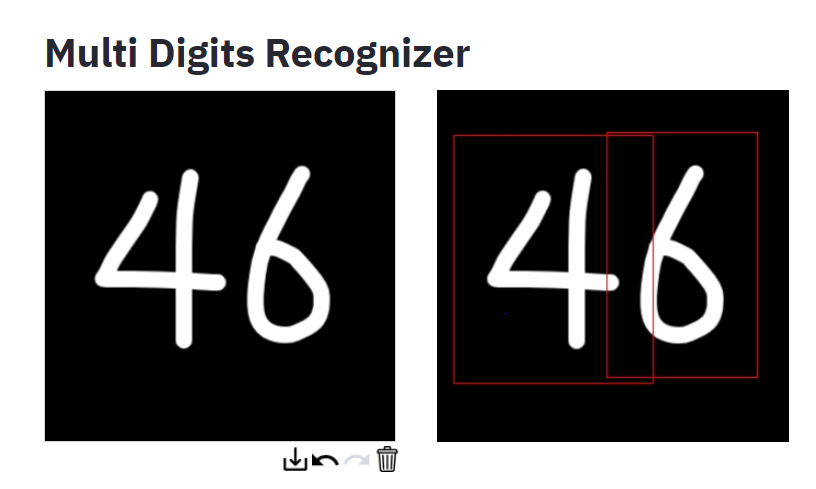

# Multi Digits Recognizer
> 잘 알려진 기존 MNIST 예제에서는 숫자 한개씩 인식할 수 있었지만, Multi Digits Recognizer에서는 여러 숫자 객체에 대해서도 인식 할 수 있다. 
인식된 각 객체들의 confidence를 Multi digits 인식기 아래의 바 그래프에서 확인할 수 있다.

첫 번째 320*320 검정색 영상에 마우스 외쪽 버튼을 누른 채로 드래그하면 숫자를 쓸 수 있다.
하나 이상의 숫자를 쓰면 객체를 찾은 후 두 번재 영상에서 빨간색 바운더리 박스를 그려 출력해 준다.
그 후, 각 객체마다 가장 높은 confidence를 가지고 있는 숫자를 result에 반환해 주고 그에 대한 바 그래프를 출력해준다.




## 사용 라이브러리

numpy
opencv
streamlit
streamlit_drawable_canvas

## 설치 방법

```
git clone https://github.com/qkrcks0/multi-digits-recognizer.git
stremlit run streamlit_multi_digits_recognizer.py
```

